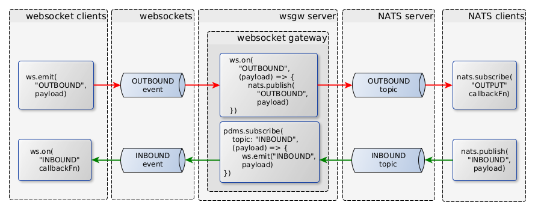
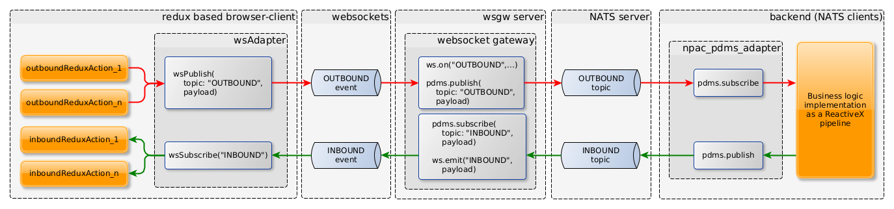
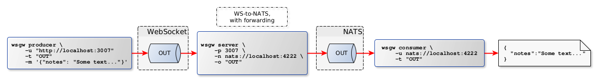
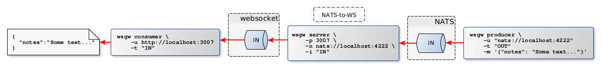
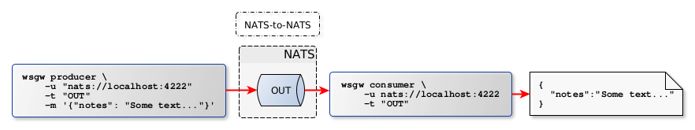

wsgw
====

[](http://github.com/badges/stability-badges)
[![npm version][npm-badge]][npm-url]

## About

`wsgw` is a CLI tool that helps to develop and debug event processing applications
that uses messaging to communicate with each other.

It makes possible the passing of messages among websocket clients and/or NATS clients.

### Events vs. topics

The WebSocket uses event handlers to manage the receiving and sending of messages.
The websocket clients can subscribe to event names, that they observe, and act in case an incoming message arrives.

The messaging middlewares typically use the topic to name the channels through which the messages are transferred.

The messages can be forwarded back-and-forth between websocket event channels and messaging topics
using their names to associate them. 

### Typical use-cases

The typical use-cases are demonstrated by the following figure:



__Important Note:__
In the followings we will use the terms of inbound and outbound message channels.
It refers to the grouping of event channels to which the messages will be send or received from by the websocket client.
So They meant to be __inbound and outbound from the viewpoint of the websocket client__ (or UI frontend application).

The functioning of the websocket gateway is quite simple:
1. We define the list of inbound and outbound event channel names.
2. The gateway will forward the messages coming in the outbound event channels to the NATS topics with the same name.
3. The gateway will also forward the messages coming in the NATS topics toward the inbound event channels.

The figure below demonstrates the more detailed architecture of a relatively complex use-case,
where the frontend is a redux application, the outgoing messages are generated by async actions,
and the incoming response messages are processed by an observer agent,
that dispatches tha arrived messages as simple redux actions into the store.



At the backend side, the business logic can be a so-called Event Processing Network,
that is implemented as a ReactiveX pipeline for example.

__Note:__
You can use several inbound and outbound topics, and do not have to use both types.
Neither the frontend has to implement full round-trips of messages.
At the same time, several frontends can connect to the WebSocket server to listen to the inbound messages.

For example you can implement a backend service, which is a sensor event consumer,
that preprocesses and forwards the measured values toward frontend applications that visualize them.
At the same time you can control the backend by sending command messages via the `wsgw` as a message producer client.

### Working Modes
The working mode is controlled by the starting command, which can be either `server`, `producer` or `consumer`.

This application can act in the following roles:

- a plain WebSocket server,
- a gateway that forwards messages among Websocket and NATS topics,
- a websocket client consuming messages from a socket,
- a websocket client publishing messages to a socket,
- a NATS messaging client consuming messages from a NATS topic,
- a NATS messaging client publishing messages to a NATS topic,
- as a websocket and NATS client producing individual and/or bulk messages from file to a socket or topic.

The main purpose of this gateway is to connect web frontend applications to backend services
that are reacheable through messaging middlewares, such as NATS,
and asynchronously pass messages back-and-forth between the services and the frontend.

__Important Note:__ The `wsgw server` mode is useful for having a standalone WebSocket server mostly during development.
__If you need a fully functional web server, with content service, authentication, and so on,
then use [easer](https://www.npmjs.com/package/easer)__ that delivers all these features to you,
including the `wsgw server` mode features as well.

## Installation

Run the install command:

    npm install -g wsgw

Check if `wsgw` is properly installed:

    $ wsgw --help

__Note:__ In order to use the `wsgw`, you also need to have a running [NATS server](https://nats.io/).

## Usage

### Overview of the application commands

```bash
    wsgw --help
    wsgw [command]

    Commands:
      app.js server    Run in server mode
      app.js producer  Run as a producer client
      app.js consumer  Run as a consumer client

    Options:
      --version  Show version number                                       [boolean]
      --help     Show help                                                 [boolean]
```

__Note__: In each modes the `wsgw` provides the following config parameters:

- `--version`: Prints the version of the application.
- `--help`: Prints the help of the selected command.
- `--logLevel`, `-l`: Sets the logging level. One of `error`, `warn`, `info`, `debug`. The default is `info`.
- `--logFormat`, `-f`: Either `plainText` or `json`. Default is: `plainText`.

The following sections shows the typical use-cases of the wsgw in different working modes.
The detaled description of the specific wsgw working modes can be found below, in dedicated sections.


### WS-to-NATS messaging



### NATS-to-WS messaging



### NATS-to-NATS messaging



### The `wsgw server`

The `wsgw server` acts as a WebSocket server, and a WebSocket-NATS gateway.

The 

The config parameters of the `wsgw server`:

```bash
    $ wsgw server --help

    wsgw server

    Run in server mode

    Options:
          --version    Show version number                                 [boolean]
          --help       Show help                                           [boolean]
      -l, --logLevel   The log level                               [default: "info"]
      -f, --logFormat  The log (`plainText` or `json`)
                                                     [string] [default: "plainText"]
      -p, --port       The webSocket server port            [number] [default: 8001]
      -i, --inbound    Comma separated list of inbound NATS topics to forward
                       through websocket                      [string] [default: ""]
      -o, --outbound   Comma separated list of outbound NATS topics to forward
                       towards from websocket                 [string] [default: ""]
      -n, --natsUri    NATS server URI used by the pdms adapter.
                                         [string] [default: "nats://localhost:4222"]
```

The server will listen on `http://localhost:8001` by default.
You can change the port by setting the `WSGW_SERVER_PORT` environment value
as well as by using the `-p` parameter.

This is an other example of using inbound and outbound NATS topics:

```bash
    wsgw server -n nats:localhost:4222 -i "IN1,IN2,IN3" -o "OUT1,OUT2"
```

__Note:__
The `wsgw server` mode is made mostly to test the `wsgw consumer` and `wsgw producer` working modes,
and to demonstrate the tool's features.
Use [easer](https://www.npmjs.com/package/easer) instead in real-world situations.


### The `wsgw consumer` client

The consumer client connects to the WebSocket server, and starts observing the selected topic.
Every time a message arrives, prints it out to the console.

```bash
    $ wsgw consumer --help

    Run as a consumer client

    Options:
          --version    Show version number                                 [boolean]
          --help       Show help                                           [boolean]
      -l, --logLevel   The log level                               [default: "info"]
      -f, --logFormat  The log (`plainText` or `json`)
                                                     [string] [default: "plainText"]
      -u, --uri        The URI of the WebSocket server
                                         [string] [default: "http://localhost:8001"]
      -t, --topic      The topic (event name) the message will be sent
                                                       [string] [default: "message"]
```

For example:

```bash
    $ wsgw consumer -t "IN1"
```


### The `wsgw producer` client

```bash
    $ wsgw producer --help

    wsgw producer

    Run as a producer client

    Options:
          --version         Show version number                            [boolean]
          --help            Show help                                      [boolean]
      -l, --logLevel        The log level                          [default: "info"]
      -f, --logFormat       The log (`plainText` or `json`)
                                                     [string] [default: "plainText"]
      -u, --uri             The URI of the WebSocket server
                                         [string] [default: "http://localhost:8001"]
      -t, --topic           The topic (event name) the message will be sent
                                                       [string] [default: "message"]
      -m, --message         The JSON-format message string to send   [default: null]
      -c, --messageContent  The file that contains the message content string to
                            send                                     [default: null]
      -s, --scenario        The name of the YAML or JSON format scenario file that
                            holds a list of messages to send         [default: null]
      -d, --dumpMessages    Dump the complete messages list to send after loading
                                                          [boolean] [default: false]
      -r, --rpc             Do RPC-like, synchronous call through NATS
                                                          [boolean] [default: false]
```

Send a direct message from the command line:

```bash
    $ wsgw producer -m '{ "a": true, "topic": "OUT1" }'
```

Send messages from a file:

```bash
    $ wsgw producer -s ./commands/producer/fixtures/test_scenario.yml
```

You can use both `-m` and `-s` parameters together.
In this case the direct message will be sent first, then the messages from the file.

This is an example messages file:
```YAML
    ---
    - delay: 200
      message:
          topic: OUT1
          payload:
              id: some-unique-id-1
              text: some plain text 1
    - delay: 100
      message:
          topic: OUT2
          payload:
              id: some-unique-id-2
              text: some plain text 2
    - delay: 300
      message:
          topic: OUT3
          payload:
              id: some-unique-id-3
              text: some plain text 3
```

The file contains an array of message entries, where each entry can contain the following properties:

- `delay`: Delay in milliseconds, to wait before sending the actual message.
  The delay is relative to the previous sending.
- `message`: The message object, to send.
- `file`: The name of the file, that contains the message. First it loads from the file, then sends it.

Note: The messages you want to send to a specific topic should contain the name of the target topic,
in the message as a `topic` property, but the event name you have to send is the `<forwardEvent>` of the server,
that is "message" by default. If you change the name of the `forwardEvent` on the server,
you also have to change it in the `producer` as well. You can use the `-t` argument for this, that is by default set to "message".

The producer command can be used to send messages to websocket server as well as to NATS.
It depends on the protocol part of the server URI.
If the URI starts with `nats://` (for example: `nats://localhost:4222`),
then the messages will be sent through the NATS middleware,
if it starts with `http:` (for example: `http://localhost:8001`), then it uses the websocket protocol.

The inbound/outbound message forwarding automatically happens in case of the websocket mode.
The topic should be `message` (this is the default value) in this case.

__Note:__
The topic handling works differently in case of the `nats:` URIs.
If we sent the messages to a NATS server, the topic should be the one you really want to send the message.
If the message itself contain the topic, it will be automatically sent to that topic, if not defined,
then the topic argument will determine it that you can define with the `-t` or `--topic` switch.
Its default value is `message`.
In case of NATS, the messages will automatically get a `$pubsub: true` property as well,
to properly forward the message to a NATS topic.

## References

- [npac](http://tombenke.github.io/npac).
- [npac-example-cli](http://tombenke.github.io/npac-example-cli).

---

[npm-badge]: https://badge.fury.io/js/wsgw.svg
[npm-url]: https://badge.fury.io/js/
