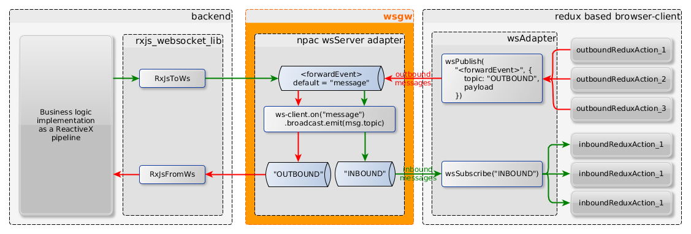
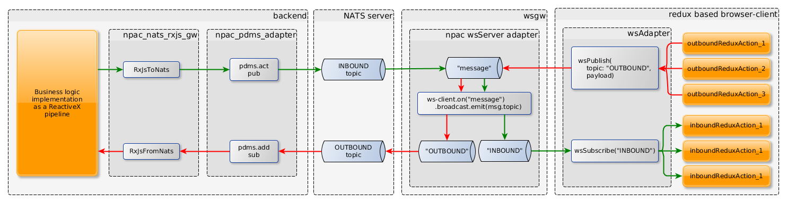

wsgw
====

[](http://github.com/badges/stability-badges)
[![npm version][npm-badge]][npm-url]
[![Build Status][travis-badge]][travis-url]
[![Coveralls][BadgeCoveralls]][Coveralls]

## About

WebSocket server and client with built-in NATS gateway functionality

The `wsgw` application can play following roles:

- a plain WebSocket server,
- a websocket client consuming messages from a topic,
- a websocket client producing individual and/or bulk messages from file to a topic,
- a gateway that forwards messages among Websocket and NATS topics.

The main purpose of this gateway is to connect web frontend applications to backend services
that are reacheable through messaging middlewares, such as NATS,
and asynchronously pass messages back-and-forth between the services and the frontend.

The backend services can directly connect to the WebSocket server as you can see on the floowing figure:



or can do it through an intermediate middleware, such as NATS:



The figures demonstrates a use-case, when the frontend is a redux application,
where the outgoing messages are generated by async actions, and the incoming response messages
are processed by an observer agent, that dispatches tha arrived messages as simple redux actions into the store.

At the backend side, the business logic is a so-called Event Processing Network,
that is implemented as a ReactiveX pipeline.

Note: You can use several inbound and outbound topics, and do not have to use both types,
neither the frontend has to implement full roundtrips of messages. At the same time,
several frontends can connect to the WebSocket server to listen to the inbound messages.

For example you can implement a backend service, which is a sensor event consumer,
that preprocesses and forwards the measured values toward frontend applications that visualize them.
At the same time you can control the backend by sending command messages via the `wsgw` as a message producer client.

## Installation

Run the install command:

    npm install -g wsgw

Check if `wsgw` is properly installed:

    $ wsgw --help

## Usage
### Run in server mode

```bash
    $ wsgw server --help

    app.js server

    Run in server mode

    Options:
      --version       Show version number                                  [boolean]
      --help          Show help                                            [boolean]
      --config, -c    The name of the configuration file     [default: "config.yml"]
      --port, -p      The webSocket server port             [number] [default: 8001]
      --forward, -f   Forwards messages among inbound and outbound topics
                                                          [boolean] [default: false]
      --inbound, -i   Comma separated list of inbound NATS topics to forward through
                      websocket                               [string] [default: ""]
      --outbound, -o  Comma separated list of outbound NATS topics to forward
                      towards from websocket                  [string] [default: ""]
      --natsUri, -n   NATS server URI used by the pdms adapter.
                                      [string] [default: "nats://demo.nats.io:4222"]
```

For example:

```bash
    $ wsgw server -f
```

The server will listen on `http://localhost:8001` by default.
You can change the port by setting the `WSGW_SERVER_PORT` environment value as well as using the `-p` parameter.

This is an other example of using inbound and outbound NATS topics:

```bash
    server -f -n nats:localhost:4222 -i "IN1,IN2,IN3" -o "OUT1,OUT2"
```


### Run in client mode

#### Run as a message consumer

The consumer client connects to the WebSocket server, and starts observing the selected topic.
Every time a message arrives, prints it out to the console.

```bash
    $ wsgw consumer --help

    Run as a consumer client

    Options:
      --version     Show version number                                    [boolean]
      --help        Show help                                              [boolean]
      --config, -c  The name of the configuration file       [default: "config.yml"]
      --uri, -u     The URI of the WebSocket server
                                         [string] [default: "http://localhost:8001"]
      --topic, -t   The topic (event name) the message will be sent
                                                       [string] [default: "message"]
```

For example:

```bash
    $ wsgw consumer -t "TMA"
```


#### Run as messages producer

```bash
    $ wsgw producer --help

    wsgw producer

    Run as a producer client

    Options:
      --version      Show version number                                   [boolean]
      --help         Show help                                             [boolean]
      --config, -c   The name of the configuration file      [default: "config.yml"]
      --uri, -u      The URI of the WebSocket server
                                         [string] [default: "http://localhost:8001"]
      --topic, -t    The topic (event name) the message will be sent
                                                       [string] [default: "message"]
      --message, -m  The JSON-format message string to send          [default: null]
      --source, -s   The name of the YAML or JSON format source file that holds the
                     messages to send                                [default: null]

```

Send a direct message from the command line:

```bash
    $ wsgw producer -m '{ "a": true, "topic": "TMA" }'
```

Send messages from a file:

```bash
    $ wsgw producer -s ./commands/producer/fixtures/test_scenario.yml
```

You can use both `-m` and `-s` parameters together.
In this case the direct message will be sent first, then the messages from the file.

This is an example messages file:
```YAML
    ---
    - delay: 200
      message:
          topic: TMA
          payload:
              id: some-unique-id-1
              text: some plain text 1
    - delay: 100
      message:
          topic: TMA
          payload:
              id: some-unique-id-2
              text: some plain text 2
    - delay: 300
      message:
          topic: TMA
          payload:
              id: some-unique-id-3
              text: some plain text 3
```

The file contains an array of message entries, where each entry can contain the following properties:

- `delay`: Delay in milliseconds, to wait before sending the actual message.
  The delay is relative to the previous sending.
- `message`: The message object, to send.
- `file`: The name of the file, that contains the message. First it loads from the file, then sends it.

## References

- [npac](http://tombenke.github.io/npac).
- [npac-example-cli](http://tombenke.github.io/npac-example-cli).

---

This project was generated from the [npac-pdms-be-archetype](https://github.com/tombenke/npac-pdms-be-archetype)
project archetype, using the [kickoff](https://github.com/tombenke/kickoff) utility.

[npm-badge]: https://badge.fury.io/js/wsgw.svg
[npm-url]: https://badge.fury.io/js/
[travis-badge]: https://api.travis-ci.org/tombenke/wsgw.svg
[travis-url]: https://travis-ci.org/tombenke/wsgw
[Coveralls]: https://coveralls.io/github/tombenke/wsgw?branch=master
[BadgeCoveralls]: https://coveralls.io/repos/github/tombenke/wsgw/badge.svg?branch=master
