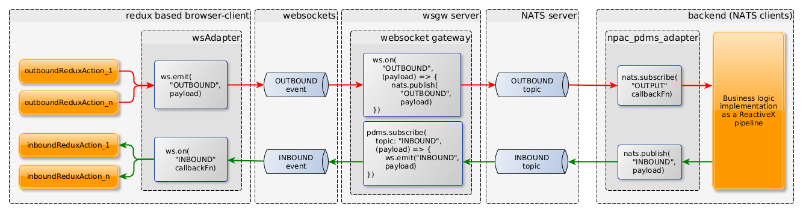

wsgw
====

[](http://github.com/badges/stability-badges)
[![npm version][npm-badge]][npm-url]

## About

`wsgw` is a CLI tool that helps to develop and debug event processing applications
that uses messaging to communicate with each other.

It makes possible the passing of messages among websocket clients and/or NATS clients.

### Events vs. topics

The WebSocket uses event handlers to manage the receiving and sending of messages.
The websocket clients can subscribe to event names, that they observe, and act in case an incoming message arrives.

The messaging middlewares typically use the topic to name the channels through which the messages are transferred.

The messages can be forwarded back-and-forth between websocket event channels and messaging topics
using their names to associate them. 

### Typical use-cases

The typical use-cases are demonstrated by the following figure:


__Important Note:__
In the followings we will use the terms of inbound and outbound message channels.
It refers to the grouping of event channels to which the messages will be send or received from by the websocket client.
So They meant to be __inbound and outbound from the viewpoint of the websocket client__ (or UI frontend application).

The functioning of the websocket gateway is quite simple:
1. We define the list of inbound and outbound event channel names.
2. The gateway will forward the messages coming in the outbound event channels to the NATS topics with the same name.
3. The gateway will also forward the messages coming in the NATS topics toward the inbound event channels.

The figure below demonstrates the more detailed architecture of a relatively complex use-case,
where the frontend is a redux application, the outgoing messages are generated by async actions,
and the incoming response messages are processed by an observer agent,
that dispatches tha arrived messages as simple redux actions into the store.



At the backend side, the business logic can be a so-called Event Processing Network,
that is implemented as a ReactiveX pipeline for example.

__Note:__
You can use several inbound and outbound topics, and do not have to use both types.
Neither the frontend has to implement full round-trips of messages.
At the same time, several frontends can connect to the WebSocket server to listen to the inbound messages.

For example you can implement a backend service, which is a sensor event consumer,
that preprocesses and forwards the measured values toward frontend applications that visualize them.
At the same time you can control the backend by sending command messages via the `wsgw` as a message producer client.

### Working Modes
The working mode is controlled by the starting command, which can be either `server`, `producer` or `consumer`.

This application can act in the following roles:

- a plain WebSocket server,
- a gateway that forwards messages among Websocket and NATS topics,
- a websocket client consuming messages from a socket,
- a websocket client publishing messages to a socket,
- a NATS messaging client consuming messages from a NATS topic,
- a NATS messaging client publishing messages to a NATS topic,
- as a websocket and NATS client producing individual and/or bulk messages from file to a socket or topic.

The main purpose of this gateway is to connect web frontend applications to backend services
that are reacheable through messaging middlewares, such as NATS,
and asynchronously pass messages back-and-forth between the services and the frontend.

__Important Note:__ The `wsgw server` mode is useful for having a standalone WebSocket server mostly during development.
__If you need a fully functional web server, with content service, authentication, and so on,
then use [easer](https://www.npmjs.com/package/easer)__ that delivers all these features to you,
including the `wsgw server` mode features as well.

## Installation

Run the install command:

    npm install -g wsgw

Check if `wsgw` is properly installed:

    $ wsgw --help

__Note:__ In order to use the `wsgw`, you also need to have a running [NATS server](https://nats.io/).

## Usage

### Overview of the application commands

```bash
    wsgw --help
    wsgw [command]

    Commands:
      app.js server    Run in server mode
      app.js producer  Run as a producer client
      app.js consumer  Run as a consumer client

    Options:
      --version  Show version number                                       [boolean]
      --help     Show help                                                 [boolean]
```

__Note__: In each modes the `wsgw` provides the following config parameters:

- `--version`: Prints the version of the application.
- `--help`: Prints the help of the selected command.
- `--logLevel`, `-l`: Sets the logging level. One of `error`, `warn`, `info`, `debug`. The default is `info`.
- `--logFormat`, `-f`: Either `plainText` or `json`. Default is: `plainText`.

The following sections shows the typical use-cases of the wsgw in different working modes.
The detaled description of the specific wsgw working modes can be found below, in dedicated sections.

We can connect to the server with a websocket client built-in to a frontend application running in a browser,
but it is also possible to test the configuration without having a frontend.

We can test the working of the gateway with the [wsgw](https://github.com/tombenke/wsgw) tool,
using its `wsgw producer` command to send messages from one side,
and the `wsgw consumer` command to consume at the other side of the server.

__Important Note:__
Be careful, and pay attention on the URLs used within the commands!
We use the same command to consume, and/or publish messages to the gateway, only the URL makes difference 
to determine which side the client will communicate with:
- When we want to connect to the websocket side, we use the `-u http://localhost:3007 ` argument,
- when we want to connect to the NATS side, we use the  `-u nats://localhost:4222 ` argument.

## Communication patterns

### WS-to-NATS messaging

The next figure shows the message flow when a WebSocket client sends messages to a NATS client through the gateway:


In one terminal window start receiving messages at the NATS side with the consumer:
```bash
    wsgw consumer -u nats://localhost:4222 -t "OUT"

    2022-03-08T09:38:30.367Z [wsgw@1.8.6] info: pdms: Start up
    2022-03-08T09:38:30.380Z [wsgw@1.8.6] info: hemera: ["Connected!"]
    2022-03-08T09:38:30.381Z [wsgw@1.8.6] info: pdms: Connected to NATS
    2022-03-08T09:38:30.382Z [wsgw@1.8.6] info: App runs the jobs...
    2022-03-08T09:38:30.382Z [wsgw@1.8.6] info: wsgw client {"channelType":"NATS","uri":"nats://localhost:4222","topic":"OUT"}
    2022-03-08T09:38:30.382Z [wsgw@1.8.6] info: Start listening to messages on NATS "OUT" topic
```

Then send some message from the websocket with the producer in another terminal:
```bash
    $ wsgw producer -u http://localhost:3007 -t "OUT" -m '{"notes":"Some text..."}'

    2022-03-08T09:39:30.325Z [wsgw@1.8.6] info: App runs the jobs...
    2022-03-08T09:39:30.334Z [wsgw@1.8.6] info: {"notes":"Some text..."} >> [OUT]
    2022-03-08T09:39:30.355Z [wsgw@1.8.6] info: Successfully completed.
    2022-03-08T09:39:30.356Z [wsgw@1.8.6] info: App starts the shutdown process...
    2022-03-08T09:39:30.357Z [wsgw@1.8.6] info: Shutdown process successfully finished
```

on the console, running the consumer, you should see something like this as a result:
```bash
    ...
    2022-03-08T09:39:30.355Z [wsgw@1.8.6] info: NATS[OUT] >> "{\"notes\":\"Some text...\"}"
```

### NATS-to-WS messaging

The next figure shows the message flow when a NATS client sends messages to a WebSocket client through the gateway:


In one terminal window start receiving messages at the websocket side with the consumer:
```bash
    wsgw consumer -u http://localhost:3007 -t "IN"

    2022-03-08T09:15:19.704Z [wsgw@1.8.6] info: App runs the jobs...
    2022-03-08T09:15:19.705Z [wsgw@1.8.6] info: wsgw client {"channelType":"WS","uri":"http://localhost:3007","topic":"IN"}
    2022-03-08T09:15:19.705Z [wsgw@1.8.6] info: Start listening to messages on WebSocket "IN" topic
```

Then send some message from the NATS side with the producer in another terminal:
```bash
    $ wsgw producer -u nats://localhost:4222 -t "IN" -m '{"notes":"Some text..."}'

    2022-03-08T09:16:16.292Z [wsgw@1.8.6] info: pdms: Start up
    2022-03-08T09:16:16.305Z [wsgw@1.8.6] info: hemera: ["Connected!"]
    2022-03-08T09:16:16.306Z [wsgw@1.8.6] info: pdms: Connected to NATS
    2022-03-08T09:16:16.306Z [wsgw@1.8.6] info: App runs the jobs...
    2022-03-08T09:16:16.309Z [wsgw@1.8.6] info: {"notes":"Some text..."} >> [IN]
    2022-03-08T09:16:16.310Z [wsgw@1.8.6] info: Successfully completed.
    2022-03-08T09:16:16.310Z [wsgw@1.8.6] info: App starts the shutdown process...
    2022-03-08T09:16:16.311Z [wsgw@1.8.6] info: pdms: Shutting down
    2022-03-08T09:16:16.311Z [wsgw@1.8.6] info: Shutdown process successfully finished
```

on the console, running the consumer, you should see something like this as a result:
```bash
    ...
    2022-03-08T09:16:16.312Z [wsgw@1.8.6] info: WS[IN] >> "{\"notes\":\"Some text...\"}"
```

### NATS-to-NATS messaging

It is even possible to use the `wsgw` commands to communicate between two NATS clients or between two websocket clients.

In these cases we only need to set `-u` parameter  either to the websocket server,
or to the NATS server for both the producer and consumer clients.

In case of connecting two WebSocket clients, we need the gateway running,
however between two NATS clients we only need a NATS server.

The following figure shows the NATS-to-NATS communication pattern:


## The usage of the `wsgw` commands

### The `wsgw server`

The `wsgw server` acts as a WebSocket server, and a WebSocket-NATS gateway.

The 

The config parameters of the `wsgw server`:

```bash
    $ wsgw server --help

    wsgw server

    Run in server mode

    Options:
          --version    Show version number                                 [boolean]
          --help       Show help                                           [boolean]
      -l, --logLevel   The log level                               [default: "info"]
      -f, --logFormat  The log (`plainText` or `json`)
                                                     [string] [default: "plainText"]
      -p, --port       The webSocket server port            [number] [default: 8001]
      -i, --inbound    Comma separated list of inbound NATS topics to forward
                       through websocket                      [string] [default: ""]
      -o, --outbound   Comma separated list of outbound NATS topics to forward
                       towards from websocket                 [string] [default: ""]
      -n, --natsUri    NATS server URI used by the pdms adapter.
                                         [string] [default: "nats://localhost:4222"]
```

The server will listen on `http://localhost:8001` by default.
You can change the port by setting the `WSGW_SERVER_PORT` environment value
as well as by using the `-p` parameter.

This is an other example of using inbound and outbound NATS topics:

```bash
    wsgw server -n nats:localhost:4222 -i "IN1,IN2,IN3" -o "OUT1,OUT2"
```
We have to define the inbound (`-i`, `--inbound`) and outbound (`-o`, `--outbound`) event channels.
We can define zero to many inbound and outbound names, separated by comma, for example: `-i "update,data,notification",
or `-o "feedback,accept"`, etc..

The following command makes the `wsgw server` using the `IN` inbound and `OUT` outbound channels:

```bash
    $ wsgw -i "IN" -o "OUT"


__Note:__
The `wsgw server` mode is made mostly to test the `wsgw consumer` and `wsgw producer` working modes,
and to demonstrate the tool's features.
Use [easer](https://www.npmjs.com/package/easer) instead in real-world situations.


### The `wsgw consumer` client

The consumer client connects to the WebSocket server, and starts observing the selected topic.
Every time a message arrives, prints it out to the console.

```bash
    $ wsgw consumer --help

    Run as a consumer client

    Options:
          --version    Show version number                                 [boolean]
          --help       Show help                                           [boolean]
      -l, --logLevel   The log level                               [default: "info"]
      -f, --logFormat  The log (`plainText` or `json`)
                                                     [string] [default: "plainText"]
      -u, --uri        The URI of the WebSocket server
                                         [string] [default: "http://localhost:8001"]
      -t, --topic      The topic (event name) the message will be sent
                                                       [string] [default: "message"]
```

For example:

```bash
    $ wsgw consumer -t "IN1"
```

### The `wsgw producer` client

The `wsgw producer` command provides the following features:
- Send a single message to a specific topic with the content defined as a CLI argument.
- Send a single message to a specific topic with the content loaded from a file.
- Send several messages according to a scenario file.
  The scenario file can hold:
  - the content of the messages,
  - the delays to wait before sending the message
  - the content of the message (directly in the scenario file, or loaded from a content file),
  - the recursive inclusion of other, sub-scenario files.
- Send messages as a combination of the previously mentioned sending methods.

The CLI parameters of the producer:

```bash
    $ wsgw producer --help

    wsgw producer

    Run as a producer client

    Options:
          --version         Show version number                            [boolean]
          --help            Show help                                      [boolean]
      -l, --logLevel        The log level                          [default: "info"]
      -f, --logFormat       The log (`plainText` or `json`)
                                                     [string] [default: "plainText"]
      -u, --uri             The URI of the WebSocket server
                                         [string] [default: "http://localhost:8001"]
      -t, --topic           The topic (event name) the message will be sent
                                                       [string] [default: "message"]
      -m, --message         The JSON-format message string to send   [default: null]
      -c, --messageContent  The file that contains the message content string to
                            send                                     [default: null]
      -s, --scenario        The name of the YAML or JSON format scenario file that
                            holds a list of messages to send         [default: null]
      -d, --dumpMessages    Dump the complete messages list to send after loading
                                                          [boolean] [default: false]
      -r, --rpc             Do RPC-like, synchronous call through NATS
                                                          [boolean] [default: false]
```

Send a direct message from the command line with direct content definition:

```bash
    $ wsgw producer -m '{ "a": true, "note": "Some notes..." }'
```

Send a single message to a specific topic with the content loaded from a file.

```bash
    $ wsgw producer -c message_content.json
```


Send messages from a scenario file:

```bash
    $ wsgw producer -s ./commands/producer/fixtures/test_scenario.yml
```

You can use `-m`, `-c` and `-s` parameters together. In this case the messages will be composed into one scenario, starting with the
message content defined by the `-m` parameter, then with the `-c` parameter, finally folowed by the ones defined via the `-s` scenario.


The file contains an array of message entries, where each entry can contain the following properties:

- `delay`: Delay in milliseconds, to wait before sending the actual message.
  The delay is relative to the previous sending.
  Default value is `0`.
- `topic`: The name of the event channel/topic to send the topic into.
  Default value is the topic name given by the `-t`, `topic` CLI parameter.
- one of `message`, `file`, `scenario`:
    - `message`: The message object, to send.
    - `file`: The path to the file, that contains the message.
      First it loads from the file, then sends it.
      The path is relative to the location of the scenario file.
    - `scenario`: The path to the scenario file to include at the point of definition.
      The included scenario has the same structure, and may contain further scenario files recursively.
      The path is relative to the location of the scenario file.

This is a list of a simple scenario:

```YAML
    ---
    - delay: 0
      topic: TMA
      message:
          id: some-unique-id-1
          text: some plain text 1
    - delay: 1000
      topic: TMA
      message:
          id: some-unique-id-2
          text: some plain text 2
    - delay: 3000
      topic: TMA
      message:
          id: some-unique-id-3
          text: some plain text 3
```

The different items in a scenario file may combine the `message`, `file` and `scenario` properties.

```YAML
    ---
    - delay: 0
      topic: TMA
      message:
        id: some-unique-id-1
        text: some plain text 1
    - delay: 1000
      topic: TMA
      file: message1.yml
    - delay: 3000
      topic: TMA
      message:
        id: some-unique-id-3
        text: some plain text 3
```

You can find a more complex, recursively nested example under the
[`src/commands/producer/fixtures/` folder](src/commands/producer/fixtures/):

For example the [`test_scenario_nested_L0.yml`](src/commands/producer/fixtures/test_scenario_nested_L0.yml)
```YAML
---
- scenario: test_scenario_nested_L1.yml
- delay: 0
  topic: NORMAL
  message:
      payload: L0_1
- delay: 1000
  file: message1.yml
- delay: 3000
  topic: NORMAL
  message:
      payload: L0_2
- scenario: test_scenario_mixed.yml
```

which includes [`test_scenario_nested_L1.yml`](src/commands/producer/fixtures/test_scenario_nested_L1.yml):
```YAML
---
- scenario: test_scenario_nested_L2.yml
- delay: 567
  topic: NORMAL
  message:
      payload: L1_1
- delay: 333
  file: message1.yml
- delay: 3000
  topic: NORMAL
  message:
      payload: L1_2
- scenario: test_scenario_nested_L2.yml
```

which further includes [`test_scenario_nested_L2.yml`](src/commands/producer/fixtures/test_scenario_nested_L2.yml)
```YAML
---
- delay: 0
  topic: NESTED
  message:
      payload: L2
- delay: 1000
  file: message1.yml
```

The [`embedded_results.json`](src/commands/producer/fixtures/embedded_results.json)
effective scenario that is finally composed by these nested scenario files.

## References

- [easer](https://www.npmjs.com/package/easer)
- [npac-wsgw-adapters](https://github.com/tombenke/npac-wsgw-adapters).
- [npac](http://tombenke.github.io/npac).

---

[npm-badge]: https://badge.fury.io/js/wsgw.svg
[npm-url]: https://badge.fury.io/js/
